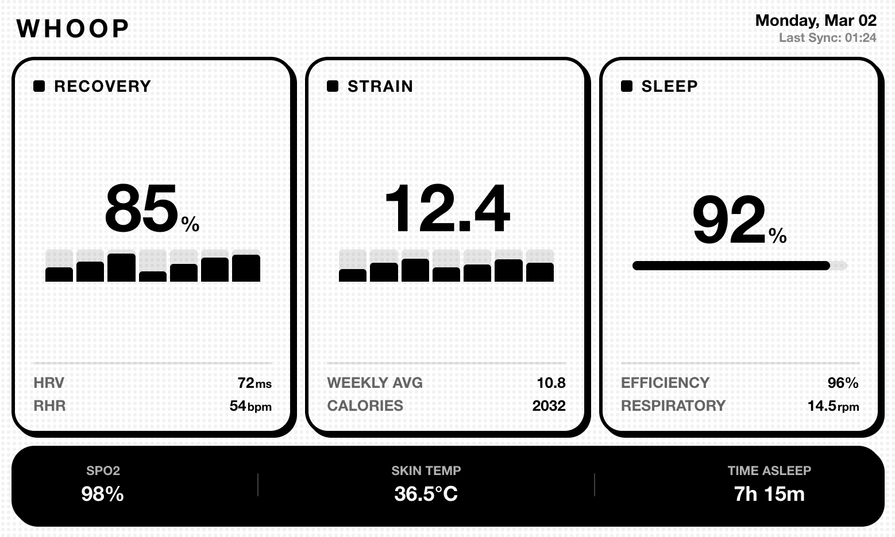

# TRMNL Whoop Plugin 🚀

A lightweight integration that brings your latest **Whoop** recovery, sleep, and strain data directly to your **TRMNL** e-ink display.


## 📱 Dashboard Preview



## ✨ Features

- **Recovery Tracking:** Monitor your Recovery Score, HRV, RHR, SpO2, and Skin Temperature.
- **Sleep Insights:** Track your sleep performance percentage.
- **Strain Analysis:** View your daily strain and weekly strain average.
- **Energy Expenditure:** Monitor kilojoules (calories) burned.
- **Auto-Refreshing:** Automatically refreshes Whoop OAuth tokens and persists them locally.
- **Periodic Updates:** Configurable polling interval to keep your device updated.

## 📊 Data Points

The following data is pushed to your TRMNL device:

| Metric | Key | Description |
| :--- | :--- | :--- |
| **Recovery** | `recovery_score` | Your daily recovery percentage (0-100) |
| **HRV** | `hrv` | Heart Rate Variability (ms) |
| **RHR** | `resting_heart_rate` | Resting Heart Rate (bpm) |
| **Sleep** | `sleep_performance` | Sleep performance percentage |
| **Strain** | `strain` | Daily physical strain (0-21) |
| **Strain Avg** | `weekly_strain_avg` | Average strain over the last 7 days |
| **SpO2** | `spo2` | Blood oxygen levels (%) |
| **Skin Temp** | `skin_temp` | Skin temperature (Celsius) |
| **Energy** | `kilojoules` | Energy expended in KJ |

## 🚀 Setup Instructions

### 1. Whoop Developer Setup
1. Visit the [Whoop Developer Dashboard](https://developer.whoop.com/).
2. Create a new App.
3. Save your **Client ID** and **Client Secret**.
4. Set a Redirect URI (e.g., `http://localhost:3000`).
5. Obtain an initial **Refresh Token** (ensure the `offline` scope is included).

### 2. TRMNL Setup
1. Log in to your [TRMNL Dashboard](https://usetrmnl.com/).
2. Navigate to **Plugins** -> **Private Plugins**.
3. Create a new plugin using the **Webhook** strategy.
4. Copy your unique **Webhook URL**.
5. Copy the code from `trmnl_template.liquid` into the **Liquid Template** section of your plugin.

### 3. Installation & Configuration
1. Clone this repository:
   ```bash
   git clone https://github.com/YOUR_USERNAME/trmnl-whoop-plugin.git
   cd trmnl-whoop-plugin
   ```
2. Install dependencies:
   ```bash
   npm install
   ```
3. Configure your environment:
   ```bash
   cp .env.example .env
   ```
4. Fill in the `.env` file with your credentials:
   - `WHOOP_CLIENT_ID`
   - `WHOOP_CLIENT_SECRET`
   - `WHOOP_REFRESH_TOKEN`
   - `TRMNL_WEBHOOK_URL`
   - `REFRESH_INTERVAL_MINUTES` (Default: 15)

### 4. Running the Plugin
Start the polling service:
```bash
npm start
```
*Note: The script will automatically update the `WHOOP_REFRESH_TOKEN` in your `.env` file when it refreshes.*

## 🛠 Deployment Options

- **Local:** Use `pm2` or a systemd service to keep the process running.
- **Raspberry Pi:** Perfect for a low-power home server.
- **Docker:** (Coming soon)

## 📄 License
MIT
